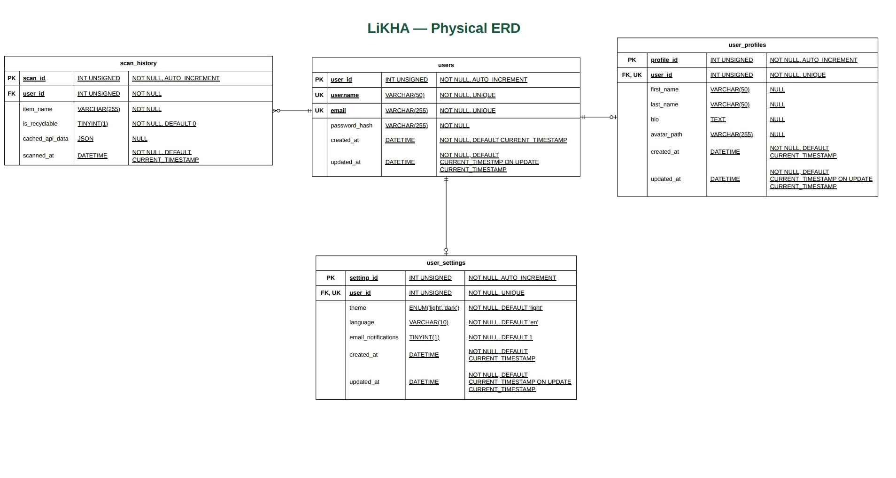

# Likha: AI-Powered Mobile Waste Identification and Visual Upcycling Guide

> Likha is a mobile-responsive web application designed to turn household scrap and unbranded waste into tangible, creative DIY upcycling projects while providing immediate recyclability and informal scrap value insights.

## 📖 About the Project

Millions of tons of everyday consumer scrap end up in overflowing landfills because individuals lack immediate, accessible visual inspiration and step-by-step guidance on how to repurpose items at home. Likha solves this by providing an AI-driven web scanner that bridges the gap between waste segregation awareness and circular crafts. Built as a borderless utility, the platform operates with zero physical logistics overhead.

## ✨ Key Features

* **Direct Mobile Capture:** Frictionless browser-based camera trigger with live client-side image preview.
* **Two-Tier AI Processing:** Strict separation between image classification and DIY ideation to minimize latency and prevent hallucinations.
* **Recyclability & Scrap Value Indicator:** Localized assessment of junk shop salvageability and approximate baseline pricing per material category.
* **Visual Upcycling ListView:** Dynamic project cards displaying project titles, difficulty levels, required crafting tools, step-by-step instructions, and representative stock reference images.
* **User Dashboard & Auth:** Secure registration and login flow with customizable user profiles and preferences.
* **Scan History:** Persistent database logging of user scans to instantly retrieve and render historical projects without redundant AI API calls.

## 🗄️ Database Architecture

The backend uses a relational database to seamlessly link authentication, user preferences, and AI scan logs. The core schema includes:

* **`users`**: Manages primary authentication credentials (`username`, `email`, `password_hash`) and automatically tracks account creation and update timestamps.
* **`user_profiles`**: Linked via a 1:1 foreign key (`user_id`), this table stores extended public-facing details like `first_name`, `last_name`, `bio`, and an `avatar_path`.
* **`user_settings`**: Enforces a 1:1 relationship with the user to manage application preferences, including an ENUM for `theme` (light/dark), `language`, and boolean `email_notifications`.
* **`scan_history`**: A 1:N relational table linking multiple scans to a single user (`user_id`). It captures the `item_name`, a boolean `is_recyclable` flag, and stores the complete AI response payload inside a native `JSON` column (`cached_api_data`) for rapid frontend rendering.

## 🛠️ Tech Stack

* **Backend:** Python 3, Django
* **Frontend:** Mobile-first HTML5, Vanilla JavaScript, and CSS3. The custom UI features the `Montserrat` font family and a distinct green-tinted color palette (e.g., `--primary-dark: #16563d`, `--card-bg: #8fe0b5`). The Django admin portal leverages built-in static vendor assets, including `jQuery` and `Select2`, for backend management.
* **AI & External APIs:** Google GenAI SDK (Gemini Flash Multimodal) for object classification and text generation; Pexels/Unsplash API for retrieving high-resolution stock project reference imagery.
* **Database:** SQLite (Local Development) / MySQL 8.0 (Production).
